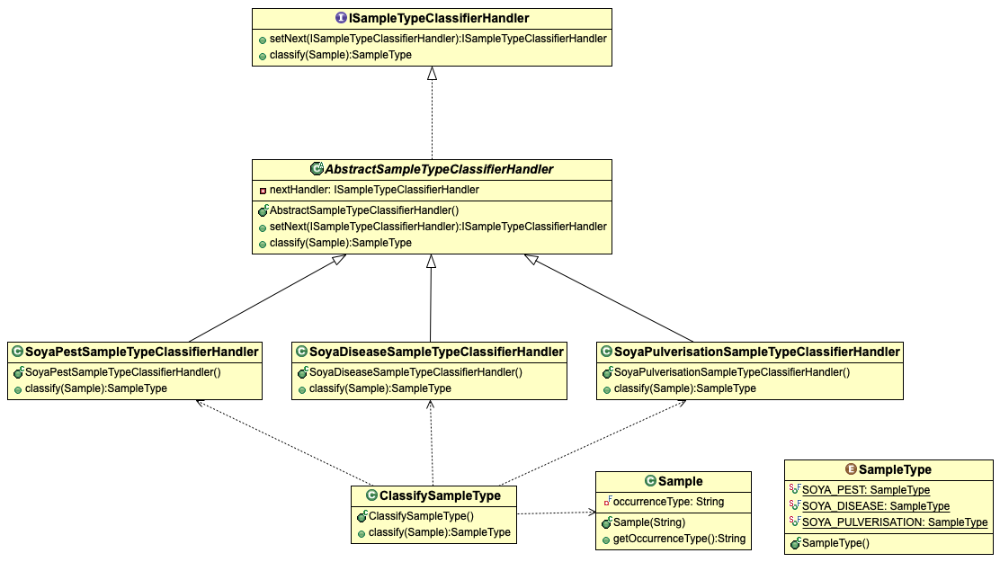
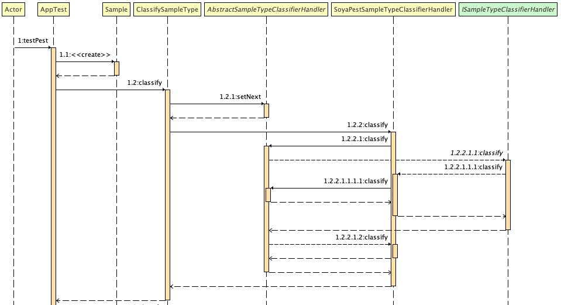

# Chain of Responsibility Design Pattern Example
Although this project is not based on any particular tutorial, I mainly used the [Refactoring Guru](https://refactoring.guru/design-patterns/chain-of-responsibility/) explanation as reference when implementing the code.

## Project Overview
The use case considers a `Sample` classification process. There are three `SampleType`'s, representing possible types of a `Sample`. The sample type discovery is done at runtime, according to the result of `Sample.getOccurrenceType()` method. 

To identify the sample type, a `Sample` is sent to a chain of classes. Each class is a subclass of `AbstractSampleTypeClassifierHandler`, responsible for defining two methods: (i) `setNext(Handler)` that defines the next handler in the chain; and (ii) `classify(Sample): SampleType` that runs the `SampleType` classification.

The `ClassifySampleType` class acts as a mediator, creating the _chain of reponsibility_ and submitting the `Sample` for evaluation. As result the class return a `SampleType` representing the sample type, or `null` in case of a `Sample` that does not fit in any `SampleType`. 

## Class Structure



* `ISampleTypeClassifierHandler` sets the two basic behaviours for any handler;

* `AbstractSampleTypeClassifierHandler` creates the base structure for all handlers. In particular, it creates an attribute (`nextHandler`), which holds the next handler in the chain. It also defines a standard behaviour for the `classify(Sample)`;

* `SoyaPestSampleTypeClassifierHandler`, `SoyaDiseaseSampleTypeClassifierHandler`, and `SoyaPulverisationSampleTypeClassifierHandler` are handlers responsible for classifying a `Sample` into one of `SampleType`'s. In case of a new `SampleType`, one should: (i) extend an `AbstractSampleTypeClassifierHandler` class, representing the new `SampleType`; (ii) add a new entry into the `SampleType` `enum`; (iii) add the new concrete `AbstractSampleTypeClassifierHandler` into the chain of responsibility defined in the `ClassifySampleType`;

* `ClassifySampleType` is a helper class. It acts as a mediator assembling the chain of responsibility and submitting the `Sample` to the chain;

* `Sample` represents an entity that carries information enabling its identification as one of `SampleType`'s;

* `SampleType` is a Java `enum` that defines a set of acceptable `Sample` types.

## Flow Structure



The Figure shows the test execution for `SampleType.SOYA_PEST` sample. The classification process starts when a `Sample` is submitted to `ClassifySampleType.classify(Sample)`. The `ClassifySampleType` sets the chain of responsiblity, defining the classification order (by the `setNext(Handler)`).

## Project Setup
```
mvn clean test
```
